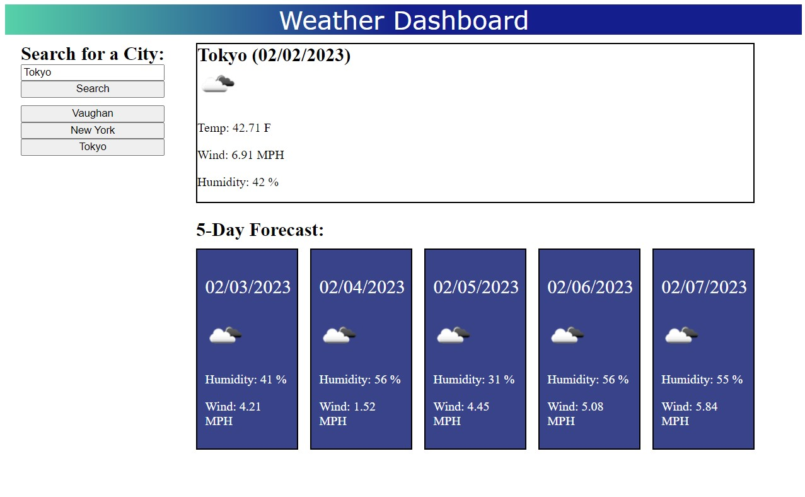

# api-weather-dashboard

## Description

The aim of this project was to create a weather dashboard, that will show the current weather as well as a forecast for the next 5 days for a city a user will type in the search field. The search inputs are saved and user will be able to access his previous search results. To obtain weather information the API of OpenWeather was used.
Working on this project, I gained further understanding of working with API, fetching data, and displaying it on a webpage.

## Installation

n/a

## Usage

When the user opens the application, they will see an input field where they can type in the city they would like to check the weather in. Once they click on the search button, they will see the current weather in the requested city, including temperature, wind speed, humidity, as well as an icon demonstrating the weather conditions. In addition, the user will see the same info for the next 5 days. Once clicked on the search button, every search input will be saved on a separate button and by clicking on it the user will be able to see the weather results for that city.

## Credits

Luba Mintsys. https://github.com/lmintsys
OpenWeather https://openweathermap.org/

## License

MIT License

Copyright (c) 2023 lmintsys

Permission is hereby granted, free of charge, to any person obtaining a copy
of this software and associated documentation files (the "Software"), to deal
in the Software without restriction, including without limitation the rights
to use, copy, modify, merge, publish, distribute, sublicense, and/or sell
copies of the Software, and to permit persons to whom the Software is
furnished to do so, subject to the following conditions:

The above copyright notice and this permission notice shall be included in all
copies or substantial portions of the Software.

THE SOFTWARE IS PROVIDED "AS IS", WITHOUT WARRANTY OF ANY KIND, EXPRESS OR
IMPLIED, INCLUDING BUT NOT LIMITED TO THE WARRANTIES OF MERCHANTABILITY,
FITNESS FOR A PARTICULAR PURPOSE AND NONINFRINGEMENT. IN NO EVENT SHALL THE
AUTHORS OR COPYRIGHT HOLDERS BE LIABLE FOR ANY CLAIM, DAMAGES OR OTHER
LIABILITY, WHETHER IN AN ACTION OF CONTRACT, TORT OR OTHERWISE, ARISING FROM,
OUT OF OR IN CONNECTION WITH THE SOFTWARE OR THE USE OR OTHER DEALINGS IN THE
SOFTWARE.
